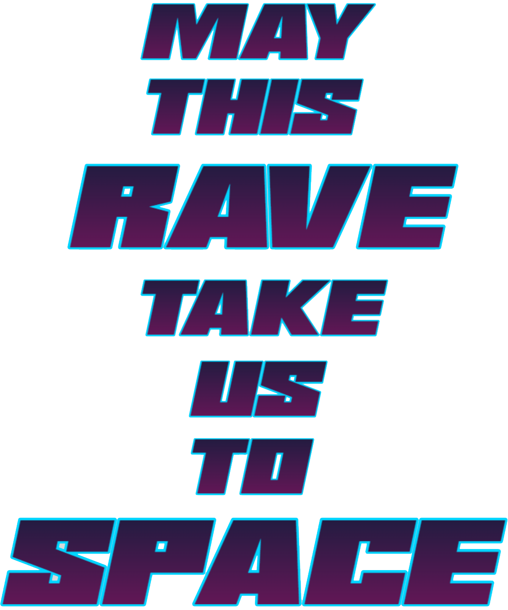

<p align="center">
  
</p>

# Silent Disco Rave — May This Rave Take Us to Space

Een mobiele webapplicatie voor het Oud & Nieuw feest in een penthouse in Breda. Bezoekers melden zich aan via een minimalistische en futuristische interface met AI-gegenereerde achtergrondvideo en muziek. De flow is ontworpen voor maximale impact op mobiele schermen, en minimale technische afleiding.

---

## Functionaliteit

- Fullscreen videoachtergrond (MP4)
- Achtergrondmuziek start na gebruikersinteractie
- Glitch-, chroma- en neon-animaties met Tailwind en CSS
- Flow-gebaseerde aanmelding: naam, aantal personen, optioneel contact
- Gegevensopslag via Azure Table Storage
- Mobiel geoptimaliseerd (9:16 aspect-ratio)

---

## Technologie

- Next.js 14 (App Router)
- Tailwind CSS
- Framer Motion
- Azure Table Storage
- Docker + Nginx Proxy Manager (deployment)
- Video + audio hosting lokaal via public/

---

## Lokale installatie

```bash
git clone https://github.com/case-1/silent-rave.git
cd silent-rave/frontend
npm install
npm run dev
```

Open de app op: [http://localhost:3000](http://localhost:3000)

---

## Deployment

De app wordt later uitgerold in Docker containers op een eigen VPS. Gebruik de bestaande Nginx Proxy Manager voor domeinrouting.

---

## Bestandstructuur (frontend)

```
/frontend
├── app/
├── public/
│   ├── maythisrave.png
│   ├── movie1.mp4
│   └── audio.mp3
├── styles/
├── globals.css
├── tailwind.config.js
└── README.md
```

---

## Opmerking

Deze app vereist geen authenticatie of toegangsbewijzen. Het doel is eenvoud, snelheid en beleving — helemaal in stijl met het event.
